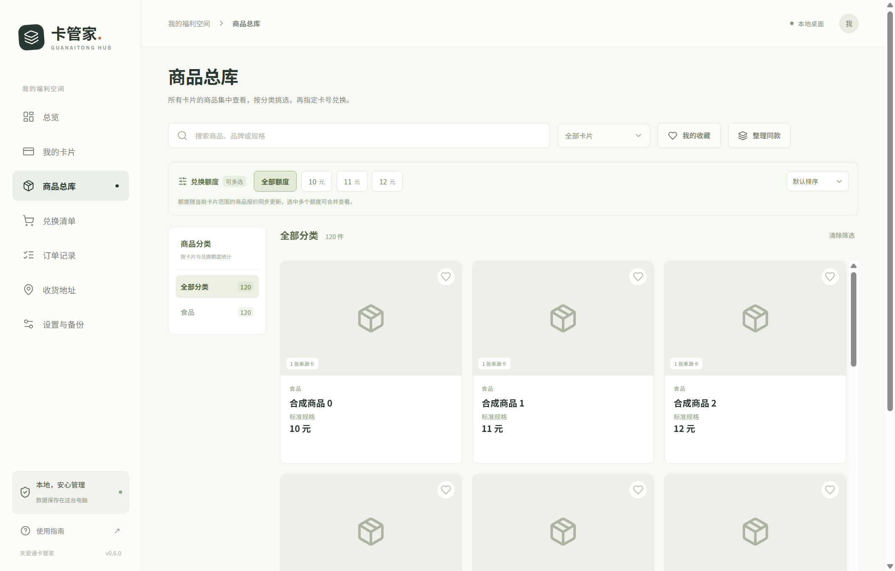

<div align="center">
  
  <h1>关爱通卡管家</h1>
  <p>把福利卡、商品、兑换清单与历史订单，放在同一个本地空间。</p>
  <p>
    
    
    
    
    <a href="https://github.com/kumamon-xu/guanaitong-hub/actions/workflows/ci.yml"></a>
  </p>
  <p><a href="#快速开始">快速开始</a> · <a href="#功能">功能</a> · <a href="#数据与隐私">数据与隐私</a> · <a href="#开发与验证">开发与验证</a> · <a href="#文档">文档</a></p>
</div>

这是一个基于 **Electron + React + TypeScript** 的非官方本地桌面工具，面向 Windows 与 macOS。账户凭据与数据保存在自己的电脑中，登录会话按卡片独立管理，兑换由用户明确确认。

**v0.7.0** 新增应用内结算与明确确认后的扣卡兑换。当前正在准备发布构建，下方安装包暂为 v0.6.2；流程与测试范围见[应用内扣卡兑换](docs/native-checkout.md)。

> [!NOTE]
> 公开仓库仅包含源码、合成测试与通用文档。真实卡号、卡密、Cookie、地址、订单记录、数据库、加密备份及现场诊断文件均不上传。

## 界面预览



*截图中的商品、卡片和统计均为合成测试数据。*

## 功能

| 模块 | 能力 |
| --- | --- |
| 卡片管理 | 单张/批量添加、标签筛选、到期提醒、本地归档、每卡独立登录 |
| 商品总库 | 同款整合、保留各卡来源报价、搜索、分类、收藏、动态额度多选、分页和虚拟滚动 |
| 兑换清单 | 指定卡片及具体报价、库存/余额校验、同单位预算提示、应用内规格/地址选择、实时结算与明确确认后的扣卡提交 |
| 同步任务 | 实际阶段与分页进度、取消、失败项重试、1～3 张卡受控并发、批次记录 |
| 订单与地址 | 订单卡片/状态/日期筛选、脱敏 CSV 导出、本地地址簿、官网地址只读查询及单独确认的新增操作 |
| 数据与更新 | SQLite 事务、系统加密、版本化迁移、统一口令备份、恢复预览、脱敏诊断、GitHub 更新、下载校验与安装交接 |

## 快速开始

下载安装包：[Windows x64](https://github.com/kumamon-xu/guanaitong-hub/releases/download/v0.6.2/guanaitong-hub-0.6.2-x64-setup.exe) · [macOS Apple Silicon](https://github.com/kumamon-xu/guanaitong-hub/releases/download/v0.6.2/guanaitong-hub-0.6.2-arm64.zip) · [macOS Intel](https://github.com/kumamon-xu/guanaitong-hub/releases/download/v0.6.2/guanaitong-hub-0.6.2-x64.zip)。[正式发布页](https://github.com/kumamon-xu/guanaitong-hub/releases/tag/v0.6.2)包含版本说明与 SHA-256 校验文件。macOS 解压后将应用移入应用目录。

v0.6.2 安装包尚未配置发布者签名，macOS 未公证；系统可能显示安全提示。

### 从源码运行

需要 **Node.js 24 或更新版本**及 npm。请在目标系统重新安装依赖。

```sh
git clone https://github.com/kumamon-xu/guanaitong-hub.git
cd guanaitong-hub
npm ci
npm start
```

Windows PowerShell 如阻止 `npm.ps1`，可将 `npm` 换成 `npm.cmd`。

### 日常使用

1. 在「我的卡片」添加卡号和密码，完成官网验证后同步。
2. 在「商品总库」按卡片、分类、关键词或兑换额度查找，查看全部来源报价。
3. 指定一张卡及具体报价，加入兑换清单或打开该卡官网商品页。
4. 在应用内选择实时规格和本卡地址，预览并明确确认扣卡，随后核对订单与余额。
5. 在「设置与备份」定期导出统一口令备份；换电脑后从备份恢复。

自动重新登录默认关闭。开启后尝试通过原官网登录页面恢复会话；不支持的验证或验证失败会转入手动官网窗口。软件退出后不运行后台任务。

> [!IMPORTANT]
> 本地清单不自动写入官网购物车或提交兑换。点击最终确认会真实产生订单并扣卡；真实测试请使用强制预览入口。各卡额度分别使用，结算以官网实时结果为准。

### 构建桌面程序

```sh
npm run package          # 当前系统的程序目录
npm run package:win      # Windows x64 安装包
npm run package:mac      # macOS 程序目录，在 Mac 上运行
```

产物位于 `release/`，不纳入 Git。Windows 目录程序需保留完整的 `win-unpacked` 目录，也可使用 `scripts/start-windows.cmd` 启动。签名安装包和更新清单的准备流程见[发布配置](docs/phase-two-three.md#发布配置)。

## 程序升级

默认更新源已接入本项目的 GitHub Releases，无需填写地址。检查正式版本后，先下载并校验 SHA-256/大小，再备份数据库；确认打开更新包时再次校验和备份，保存会话后退出交接。没有正式 Release 时会明确提示，草稿和预发布不会作为稳定更新。

**v0.6.0 需要先手动安装 v0.6.1 或更新版本**，之后使用新的 GitHub 更新流程。v0.6.1/v0.6.2 用户可通过程序内更新升级。v0.7.0 将 SQLite 与统一备份升级至 v4，迁移前自动创建安全副本，保留原有卡片、地址和会话；不要清空应用数据目录。发布配置与回退方式见[发布配置](docs/phase-two-three.md#发布配置)及[迁移说明](docs/sqlite-migration.md)。

## 数据与隐私

- 数据使用本地 SQLite，无需单独维护数据库服务。卡号、密码、地址、Cookie 及自由文本载荷在入库前使用 Electron `safeStorage` 加密。
- 每张卡使用独立内存浏览器会话；官网网页没有 Node 权限或本地数据访问权限。
- 完整同步快照通过事务提交。失败或中断保留上次完整数据，只有已确认的零余额才可自动归档。
- 新版 `.gathub` 使用独立口令、scrypt 和 AES-256-GCM，包含本地卡片数据、地址、报价历史及同步记录。恢复前预览并自动备份当前数据库，兼容旧 `.gathub` 和 `.gataddr`。
- 系统加密绑定原设备和系统用户。跨电脑迁移使用口令备份，Cookie 不随备份迁移，需要重新官网登录。
- 应用直接连接官网；没有开发者数据上传接口。公开问题报告和截图也应先脱敏。

数据目录：Windows 为 `%APPDATA%\guanaitong-hub\vault`，macOS 为 `~/Library/Application Support/guanaitong-hub/vault`。不要将这些目录复制到仓库中。详见[安全与隐私](SECURITY.md)及[迁移与恢复](docs/sqlite-migration.md)。

## 开发与验证

```sh
npm run dev                  # 开发模式；普通浏览器中展示合成演示
npm run check                # ESLint + TypeScript + 单元测试
npm run test:login-browser    # 本地合成登录页面回归
npm run test:desktop          # 临时目录中的真实 Electron / 系统加密检查
git add <reviewed-files>
npm run audit:public         # 审查 Git 暂存区是否适合公开
```

常规测试不会访问个人应用数据或登录真实账号。开发版 160 项本地测试、Windows 原生结算与更新验证、旧版写入→新版读取回归已通过；新增代码尚未进行在线发布构建。范围与真实预览入口见[验证说明](docs/verification.md)和[应用内扣卡兑换](docs/native-checkout.md)。自动检查与手动签名构建配置位于 `.github/workflows/`。

```text
src/          React 页面、共享类型、筛选与预算规则
electron/     主进程、IPC、官网适配、数据库、同步与备份
tests/        合成单元、浏览器、原生桌面及授权测试入口
scripts/      开发、构建、验证、发布与公开内容审查
docs/         通用设计文档与合成演示截图
assets/       应用图标
```

## 文档

- [数据库迁移与恢复](docs/sqlite-migration.md)
- [查询、同步、管理与发布配置](docs/phase-two-three.md)
- [官网接入边界](docs/site-integration.md)
- [商品分类规则](docs/category-integration.md)
- [按需登录与手动接续](docs/auto-login.md)
- [官网订单确认边界](docs/direct-order-feasibility.md)
- [验证说明](docs/verification.md)
- [版本记录](CHANGELOG.md) · [参与开发](CONTRIBUTING.md) · [安全与隐私](SECURITY.md)

官网接口和验证方式可能变化。遇到问题时可提供脱敏诊断与复现步骤，避免在 Issue 中上传真实账户、地址或备份文件。
